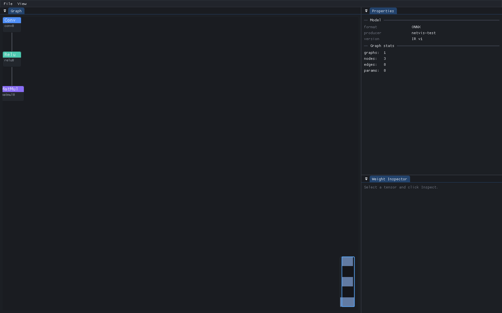
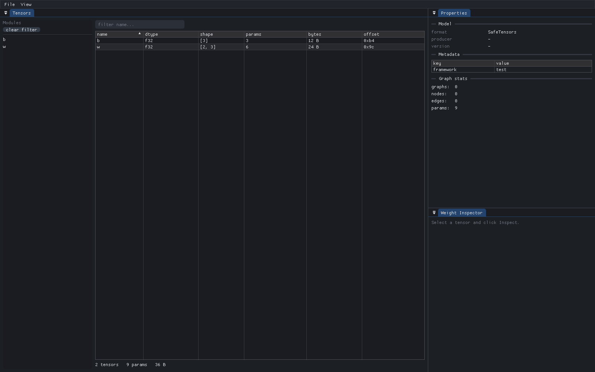
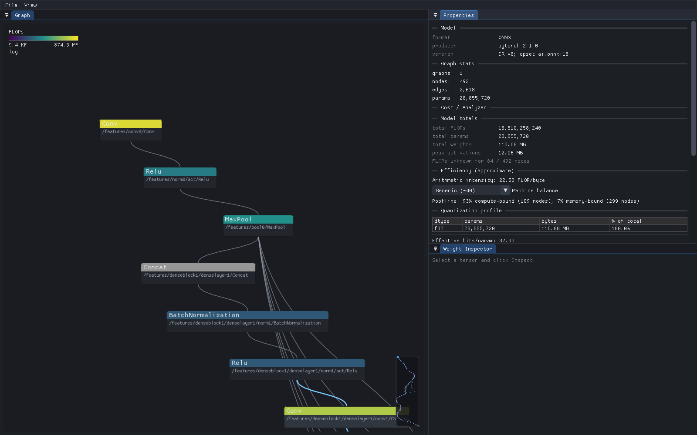
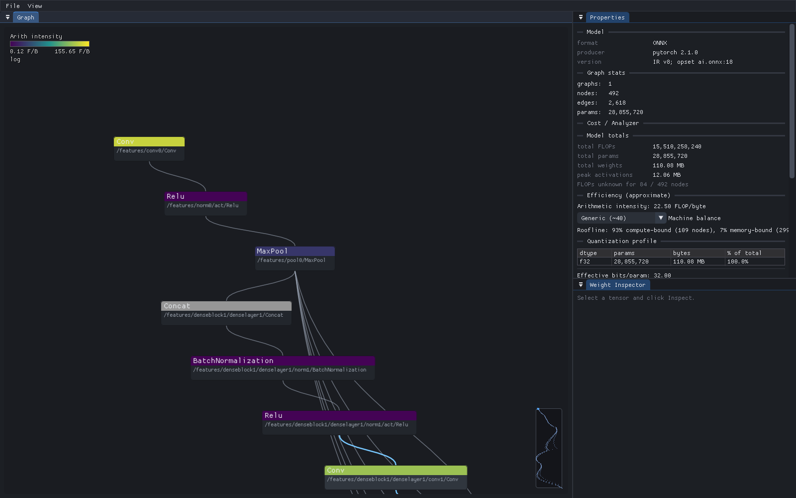

# NetVis

A speed-first native desktop viewer for neural-network model files — a from-scratch
alternative to Netron, designed so that opening and navigating a multi-gigabyte
model is effectively instant.

The core idea: **weights are never eagerly loaded.** Parsers memory-map the file
and record only *offset + length* for every tensor payload; the bytes stay on disk
until you actually open a tensor in the weight inspector. Opening a 5 GB model
touches only its structure — a few megabytes — so the graph is on screen in well
under a second.



*ONNX compute graph — nodes colored by op category, model stats in the properties
panel, minimap bottom-right.*



*Tensor-table mode (SafeTensors / GGUF / PyTorch state-dicts) — virtualized,
sortable table with a module hierarchy tree.*



*Analyzer mode on DenseNet-161 (ONNX) — cost heatmap tinting the graph by FLOPs,
with the properties panel showing model totals, arithmetic intensity, a roofline
memory-/compute-bound breakdown, and the quantization profile — all computed from
shapes alone, no weights read.*



*Same model, heatmap switched to the arithmetic-intensity metric — compute-bound
convolutions (green) stand out from memory-bound activations/pooling (purple).*

## Features

- **Formats:** ONNX (`.onnx`), TFLite (`.tflite`), SafeTensors (`.safetensors`),
  GGUF (`.gguf`), PyTorch zip & legacy pickle checkpoints (`.pt` / `.pth` / `.bin`).
- **Instant open:** memory-mapped I/O; structure parsed off the main thread; the
  window is interactive the moment the `mmap` succeeds.
- **Compute-graph canvas:** a single custom-drawn region (no per-node widgets) with
  viewport culling, level-of-detail tiers, pan/zoom, selection, and a minimap.
  Draw cost is O(visible), not O(total).
- **Collapse tree:** repeated blocks (e.g. 32 identical decoder layers) are detected
  and collapsed into `×N` super-nodes, so even 100k-node graphs lay out in
  milliseconds. Double-click to expand.
- **Deterministic layered layout:** from-scratch Sugiyama-style layout (longest-path
  layering, barycenter crossing reduction, bezier edges). Same file → same layout,
  cached to disk keyed by structure hash. Shared constants/weights are **duplicated
  next to each consumer** and long edges are routed through dummy nodes, so a big
  graph reads as a clean flow instead of a top-row hairball. A one-key toggle hides
  constant/weight edges entirely and badges each consumer with a `+N` count.
- **Graph navigation:** click a node to highlight its fan-in/fan-out (dimming the
  rest), focus/isolate an N-hop neighborhood, filter by op category, and jump the
  camera to a value's producer or consumers.
- **Model diff:** open a second model as a comparison and the graph tints nodes
  **added / removed / changed** — before/after quantization or fine-tuning at a
  glance. The comparison loads on its own background pipeline; the main thread
  never stalls.
- **Analyzer mode:** a static, zero-payload cost report — per-node and model-wide
  **FLOPs, parameter counts, weight bytes, and peak activation memory** computed
  from shapes alone (no weights read), plus a **quant-coverage** table (per-dtype
  params/bytes, effective bits/param, size-vs-fp32). Estimates are honest:
  unsupported ops / unresolved shapes are reported as unknown, never faked.
  FLOP coverage spans convolutions, matmuls/Gemm, **attention & multi-head
  attention**, **recurrent LSTM/GRU/RNN**, **quantized** ops (QLinearConv /
  QLinearMatMul / MatMulInteger / ConvInteger / QGemm and the QDQ markers), a
  constrained Einsum resolver, and a broad set of elementwise / activation /
  reduce primitives.
- **Efficiency metrics (v0.4.0):** per-node **arithmetic intensity** (FLOP per byte
  moved) and a **roofline** classification (memory-bound vs compute-bound against a
  selectable machine-balance preset) with a model-level compute-bound fraction —
  all pure over shapes, labeled as the estimates they are.
- **Cost heatmap:** a one-key overlay that tints the graph by a **selectable metric**
  — FLOPs, parameters, activation bytes, or arithmetic intensity — with a
  **customizable gradient** (colorblind-safe Viridis / Magma / Cool→Hot / Grayscale
  presets or your own low/mid/high stops, log or linear scale, metric-aware
  on-canvas legend). The cost summary copies to the clipboard as TSV, and view
  preferences persist across sessions.
- **Weight inspector:** lazily decodes a tensor to streaming stats (min/max/mean/std,
  zero & NaN/Inf counts, 64-bucket histogram) without materializing a converted
  copy. Export to `.npy` or raw `.bin`.
- **Shape inference (ONNX):** best-effort propagation over the common ops (incl.
  constant-driven Reshape/Slice/Gather/Concat/Transpose/Split, attention,
  recurrent LSTM/GRU/RNN multi-output, quantized QLinear*/Integer/QDQ, and dtype
  propagation) fills in edge shape labels in the background — which in turn feed
  the analyzer's FLOP estimates. TFLite `If`/`While`/`CallOnce` subgraphs are
  linked and divable.
- **Search:** fuzzy, case-insensitive substring/subsequence search over all names;
  Enter flies the camera to the hit.
- **Tensor-table mode:** graph-less formats (GGUF/SafeTensors/PyTorch) show a
  virtualized, sortable tensor table with a dotted-key module hierarchy.
- **Safety:** the PyTorch pickle reader is a *restricted VM* with an explicit
  allowlist — unknown reduce targets become inert placeholders, never executed.
- Dark/light themes, PNG export of the current view, recent files, drag-and-drop,
  CLI open, and a status bar with per-stage load timings.

## Performance

Measured on this machine (16-core, `-O2 + LTO`), synthetic 10,000-node graph:

| Stage | Time |
|---|---|
| `mmap` (any file size) | ~1 ms |
| collapse-tree build (10k nodes) | ~1.2 ms |
| default (collapsed) layout | ~0.1 ms |
| search query over names | < 5 ms |
| tensor payload reads during parse | **0** |

The zero payload reads during parse is asserted by the test suite via a counting
`ByteReader` — it is the property the whole design exists to guarantee.

## Building

Requires CMake ≥ 3.24, a C++20 compiler, and (for the GUI) OpenGL + a windowing
system. All other dependencies are fetched and pinned via CMake `FetchContent`
(GLFW, Dear ImGui docking, nlohmann/json, miniz, stb, tinyfiledialogs, doctest).

```sh
# Full app (Release, -O2 + LTO)
cmake --preset release
cmake --build --preset release
./build/release/netvis path/to/model.onnx

# Headless core + tests only (no OpenGL/GLFW needed — CI-friendly)
cmake --preset core-only
cmake --build --preset core-only
ctest --preset core-only
```

Open a model via the `File → Open` dialog, by dragging it onto the window, or by
passing it as a CLI argument.

## Architecture

Three strictly separated layers; the view never touches parsers directly.

```
View (Dear ImGui)   — window, dockspace, graph canvas, panels, dialogs
      │  talks only to ModelSession
Engine              — ModelSession, LayoutEngine, CollapseTree, SearchIndex,
      │                ShapeInference, TensorStats, LayoutCache, JobSystem
Parsers → ir::Model — onnx/ tflite/ safetensors/ gguf/ pytorch/
```

- `core/` — `MappedFile`, bounds-checked `ByteReader`, `StringArena` (interned
  strings + 32-bit handles), `JobSystem` (thread pool + main-thread completion
  queue), `SmallVec`, FNV-1a hashing, `Result<T>` error handling.
- `ir::Model` — cache-friendly struct-of-arrays: POD nodes/values with 32-bit
  indices and interned string handles.

See `CONTRACTS.md` for the frozen interface contracts and `DECISIONS.md` for the
rationale behind every performance-relevant choice.

## Testing

`tools/gen_fixtures.py` (Python 3 stdlib only) hand-encodes tiny fixture models for
each format. The doctest suite covers each parser (asserting zero payload reads),
format detection, layout determinism, the pickle VM opcode set + allowlist
rejection, NPY export round-trip, and truncation resilience.

```sh
python3 tools/gen_fixtures.py tests/fixtures
ctest --preset core-only
```

### Sanitizers

The test suite runs clean under AddressSanitizer (+UBSan) and ThreadSanitizer:

```sh
cmake --preset asan  && cmake --build --preset asan  && ctest --preset asan
cmake --preset ubsan && cmake --build --preset ubsan && ctest --preset ubsan
cmake --preset tsan  && cmake --build --preset tsan  && ctest --preset tsan
```

## CI & releases

`.github/workflows/ci.yml` runs on every push/PR: the ASan+UBSan and TSan
sanitizer suites plus a headless `core-only` build + `ctest`.

Pushing a `vX.Y.Z` tag additionally builds the per-OS installers and publishes a
GitHub Release with them attached:

- **Windows** — NSIS installer (`.exe`)
- **macOS** — `.dmg` (drag `NetVis.app` into `/Applications`)
- **Linux** — portable `.zip`

```sh
git tag v1.2.0 && git push origin v1.2.0
```

To cut a release without a tag push (e.g. re-cutting a broken one), run the
**release-override** workflow from the Actions tab with an explicit version.
Packaging is driven by CPack; build one locally with:

```sh
cmake -B build -DNETVIS_VERSION=1.2.0 -DNETVIS_BUILD_TESTS=OFF
cmake --build build
cd build && cpack        # generator auto-selected per OS
```

## Non-goals (v1)

No model editing, no inference/execution, no dequantization of GGUF quant blocks,
no TorchScript/FX graph reconstruction, no web build. (A plugin system — declarative
op definitions plus a sandboxed WASM tier for parsers/passes — is designed for a
future release; see `docs/v0.6.0-plan.md`.)
